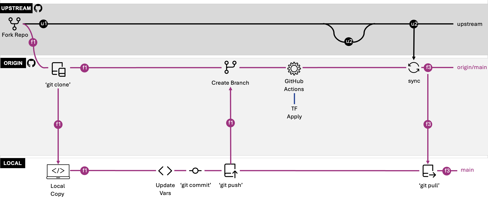

# xc-ce-training

This repo creates a GitHub Actions CI/CD workflow to deploy SMSv2 site into Azure.  The workflow is a very simple 101, as shown in the diagram below. 

## Prerequisites

- VScode: Install VSCode 
- Git CLI: install the git CLI tools
- GitHub: Create or validate that you have a GiHub Account and can login.
    - Test that you can git clone and git push (this will test that your git creds work in the CLI)
- Azure: Validate that you have access to the correct subscription.
    - Open the Azure Portal (https://portal.azure.com/) and login with SSO.  Search for Subscriptions in the search box at the top of the screen.
    - If you don't have any subscription listed, please open a ServiceNow Ticket to get access.

## Lab Guide

1. Fork this repo to your githib account and on the 'Actions' tab, make sure that GitHub Actions are enabled, by acknowledgeing the terms.

2. In VScode, open your working folder and `git clone <git url>` the repo to your local machine

3. You need to configure API access to your Azure account:
    - within the Azure `Mircosoft Entra ID`, navigate to `Manage` >> `App Registration` and create a new `App`.
    - within the new `App` you just created, create a new Client Secret.  The `value` must be saved, as you cannot retrieve it again:  
        - the `value` is your `ARM_CLIENT_SECRET`.
    - the `App` overview page will provide:
        - the `Application (Client) ID` is your `ARM_CLIENT_ID`
        - the `Directory (Tenant) ID` is your `ARM_TENANT_ID`
    - 'Expose an API' by adding a 'Scope' and a 'Client Application', with the latter referencing your 'Application (Client) ID'.
    - if you type 'subscriptions' into the search box at the top of the Azure Portal, you can find your Subscription ID:
        - the 'Subscription ID' is your `ARM_SUBSCRIPTION_ID`
    - **IMPORTANT** within your subscription, go to 'Access Control (IAM)' and 'Role Assignments'.  Add a Role Assignment and give your 'App' the 'Contributor Role'.  

4. Create Azure Storage Account.  Use default values except for the following items: 
    - Create new `Resource Group`
    - Enter `Storage account name`
    - For `Primary Service` select `Azure Blob Storage or Azure Data Lake Storage Gen 2 (Standard)`
    - On the `Tags` tab, create a tag as follows:  `Name` = `Owner`, `Value` = `Your email address`
    - Click `Review and Create` and then `Create`
    - After creation navigate to your Azure Storage Account and on the left menu, select `Data Storage` >> `Containers`
        - Click `+ Container` to create a new container and give it the name `terraform-git-actions` and then click `create`
    - Again, on the left menu, select `Security + networking` >> `Access Keys`
        - Click `Show` the `Key` (on one of the keys) and make a note of the key because we will use this in step 6 below

5. Login to XC and navigate to `Administration Workspace` >> `Personal Management` >> `Credentials` >> `Add a Credential`
    - Create an `API Certificate` credential with a complex (important for this training!) password and short expiry
        - Make a note of the complex password because you will use it in step 6 below
    - Copy `.p12` file to your cloned repo folder

6. in VScode, Update variables and values:
    - Rename `vars.auto.tfvars.example` to `vars.auto.tfvars` and modify values to match your deployment
    -- **IMPORTANT** make sure you remember to use the correct name for your .p12 file
    - In `provider.tf` update the values for `resource_group_name` and `storage_account_name` to match the values you used to create the Storage Account in step 3.

7. In the github UI, make sure you are logged in and then navigate to your forked copy of this repo
    -  Click the `Settings` tab >> `Security` >> `Secrets and variables` >> `Actions`
    -  Create the following `New Repository Secret`s: 
        - Set `Name` = `AZURE_BACKEND_KEY` and for `Value` use the storage key you saved at the end of step 4 above
        - Set `Name` = `VES_P12_PASSWORD` and for `Value` use the complex password you saved in step 4 above
        - Set `Name` = `ARM_CLIENT_ID` and for `Value` use the application (client) ID from the app registration in step 3 above
        - Set `Name` = `ARM_TENANT_ID` and for `Value` use the tenant ID obtained in step 3 above.
        - Set `Name` = `ARM_SUBSCRIPTION_ID` and for `Value` use the subscription ID obtained in step 3 above.
        - Set `Name` = `ARM_CLIENT_SECRET` and for `Value` use the client secret obtained in step 3 above.

8. At the CLI, cd into the cloned folder e.g. `cd xc-ce-training` and then push your updated config to your git origin:
    - `git add .` or if you want to be specific `git add provider.tf vars.auto.tfvars`
    - `git commit -m "<insert your message here e.g. updated vars>"`
    - `git push` - this should trigger GitHub Actions to try your first deployment.

    - ! If you have authentication issues pushing to GiHub and it asks you to generate a personal access token, visit `https://github.com/settings/personal-access-tokens` and create a `fine-grained token` with `read-write permissions` for `Content`.  When prompted by `git push` command, use your github username and your `personal access token` as your password.   

9. Review the configuration of your SMSv2 site in the XC console and your VM in Azure.
10. Delete your SMSv2 site in the XC console and your VM in Azure.
11. Use the ClickOps method to deploy a new CE, with the same settings as the original: 
    - Navigate to https://docs.cloud.f5.com/docs-v2
    - Scroll down and click `Multi-Cloud Network Connect`
    - From the left menu >> `How To` >> `Site Management` >> `Deploy Secure Mesh Site v2 in Azure (ClickOps)`
